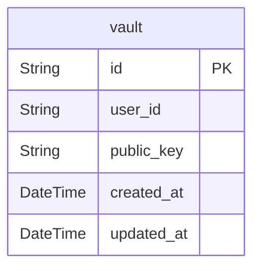

# Database Schema

> Generated by [`prisma-markdown`](https://github.com/samchon/prisma-markdown)

- [Vault](#vault)

## Vault

### `vault`

user vault

**Properties**

- `id`: UUID primary key
- `user_id`: user device id (namespace::userId)
- `public_key`: device public key, used to limit device count
- `created_at`: a string to be decoded into a DateTime.Utc
- `updated_at`: a string to be decoded into a DateTime.Utc
