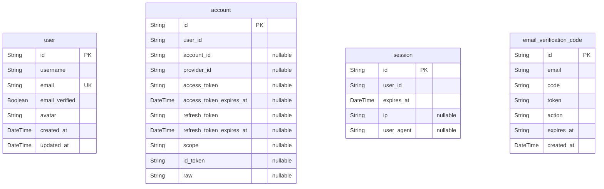

# Database Schema

> Generated by [`prisma-markdown`](https://github.com/samchon/prisma-markdown)

- [default](#default)

## default

### `user`

**Properties**

- `id`: User ID
- `username`: The user's username
- `email`: The user's email address
- `email_verified`: Whether the user's email has been verified
- `avatar`: The user's avatar
- `created_at`: a string to be decoded into a DateTime.Utc
- `updated_at`: a string to be decoded into a DateTime.Utc

### `account`

**Properties**

- `id`: Account ID
- `user_id`: User ID
- `account_id`: OAuth Provider Account ID
- `provider_id`: OAuth Provider ID
- `access_token`: OAuth Access Token
- `access_token_expires_at`: OAuth Access Token Expiration Date
- `refresh_token`: OAuth Refresh Token
- `refresh_token_expires_at`: OAuth Refresh Token Expiration Date
- `scope`: OAuth Scope
- `id_token`: OAuth ID Token
- `raw`: OAuth Account Raw Data

### `session`

**Properties**

- `id`: UUID primary key
- `user_id`: User ID
- `expires_at`: a number to be decoded into a Date
- `ip`: The IP address of the user
- `user_agent`: The user agent of the user

### `email_verification_code`

**Properties**

- `id`: UUID primary key
- `email`: The user's email address
- `code`: The verification code
- `token`: The verification token
- `action`: The action to be performed
- `expires_at`: a valid Date instance
- `created_at`: a string to be decoded into a DateTime.Utc
